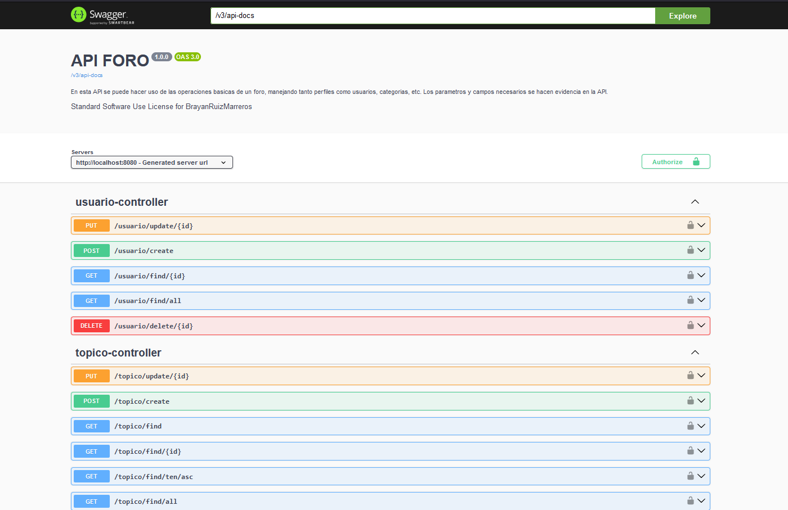

# API FORO

## 📖 Descripción
El proyecto se basa principalmente en la logica de negocio que sucede detras de un foro, haciendo referencia por ejemplo al foro de Alura. Un excelente proyecto y completo que abarca el control de versiones de las modificaciones a la base de datos hasta brindarle una capa de seguridad, incluyendo su implementacion de documentacion de la API. Para más detalles sobre cómo utilizar la API, consulta la documentación completa probando la API. Si tienes preguntas o necesitas soporte, no dudes en contactarme como creador del proyecto.
## 🔨 Funcionalidades
- `Buscar por topicos`:Permite a los usuarios buscar tópicos específicos utilizando criterios de búsqueda como el nombre del curso y año.
- `Listar topicos`: Devuelve una lista completa de todos los tópicos disponibles en la base de datos.
- `Editar topicos`: Permite a los usuarios editar la información de un tópico existente.
- `Eliminar topicos`: Permite a los usuarios eliminar un tópico específico.
- `Registrar usuarios`: Permite a nuevos usuarios registrarse en la aplicación proporcionando sus detalles básicos.
- `Modificar usuarios`: Permite a los usuarios registrados modificar sus datos de perfil.
- `Autenticar usuarios`:Permite a los usuarios autenticarse proporcionando sus credenciales, devolviendo un token JWT para acceder a las rutas protegidas.
Hay muchisimas funciones más, definidas 
## 🕹️ Uso
La api es bastante intuitiva debido a que esta propiamente documentada mediante Swagger, y al tener una capa de seguridad extra, esta permitida a enviar tokens mediante su interfaz para las consultas

Te invito a probar las demás funcionalidades y a sumergirte en el tema por ti mismo 🤟
## ✔️ Tecnologias
Hice uso de las siguientes tecnologias para lograr la construccion de este proyecto.
- [ModelMapper](https://modelmapper.org/)
- [Hibernate](https://hibernate.org/) 
- [Mysql](https://www.mysql.com/)
- [Postman](https://www.postman.com/)
- [SpringBoot](https://spring.io/projects/spring-boot)
- [Visual Studio Code](https://code.visualstudio.com/)
- [Spring Initializr](https://start.spring.io/)
- [JWT Token](https://github.com/auth0/java-jwt)
- [Swagger](https://springdoc.org/)

## 👨‍💻 Sobre el Autor
Soy Brayan Ruiz Marreros, al momento de subir este proyecto tengo 23 años, soy egresado de la carrera de Ingeniería de Sistemas e Informática, me motivan los desafios y me gusta aprender cosas nuevas en el rubro de la programación. En mis ratos libres veo alguna serie o pelicula y juego Age Of Empires🏰. 

